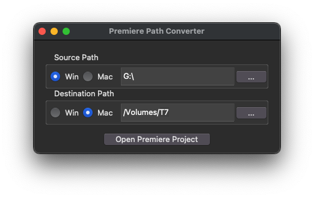

# Premiere Batch Path Converter
This is a Python script that batch modifies the file paths inside an Adobe Premiere project, bypassing the built-in relinking process. It functions like a slightly more sophisticated find and replace feature, which is useful if a project has been moved to a different drive, or if you want to move between operating systems. 

### How to run it:
Download and install the Python interpreter from python.org if you don't already have it. Then open a Terminal window in the folder with the script and run "python3 path_converter.py" or "py path_converter". 

A window will appear. If it doesn't, or if it's blank, your Python interpreter might be out of date.

The source path is the file path you want to change, and the destination path is what you want to replace it with. After you've made your selections, press Open Premiere Project to preview and confirm the changes.

### WARNING: Use at your own risk, and make backups of anything important.
I made this script to suit my specific needs, so it probably has bugs and edge cases I didn't think of. It also involves mucking around in an undocumented file format that Adobe could change at any time. If something breaks, I'm not responsible for any loss of data.

